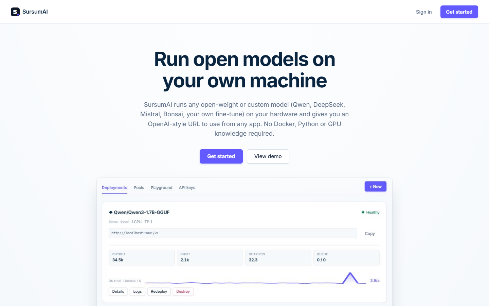
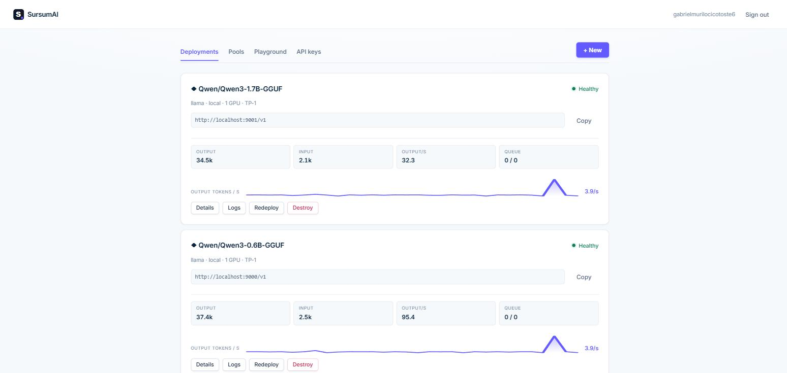
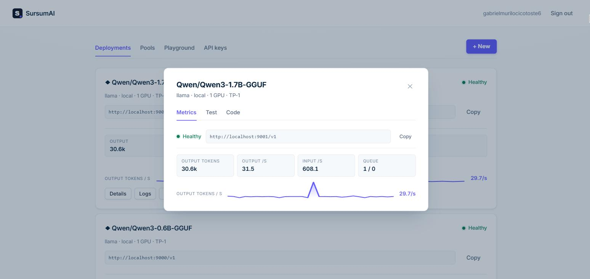
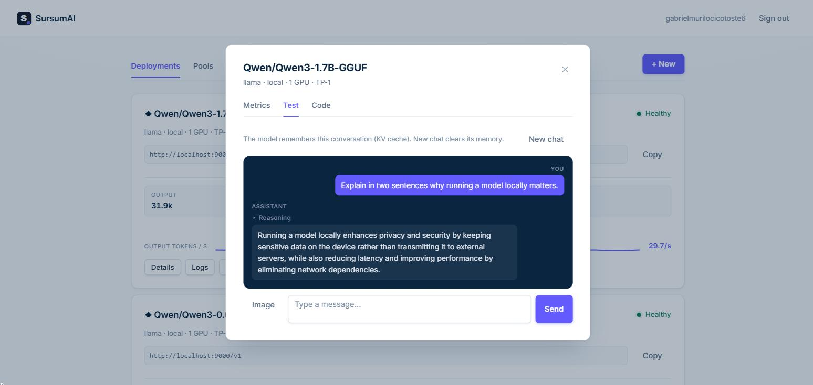
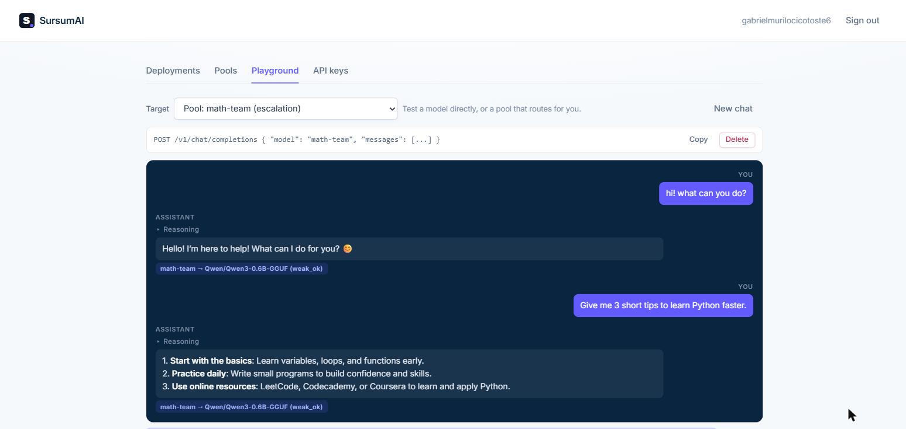
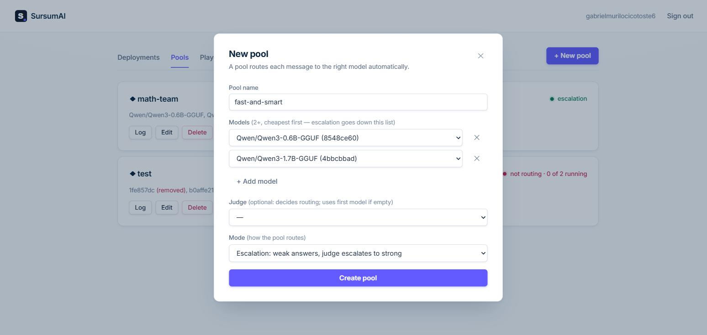

# SursumAI — Self-Hosting Models

[](https://github.com/Ga0512/SursumAI/actions/workflows/tests.yml)
[](LICENSE)

> Your model. Your machine. Your URL.

SursumAI runs **open-source AI models on your own machine** and gives you an
OpenAI-style URL to use — all through a web interface. No terminal, Docker,
Python, or GPU knowledge needed to get started.

Pick a model, click **Deploy**, and you get a link any OpenAI-compatible app can
use.

---

## Screenshots

| | |
|---|---|
|  |  |
| **Landing** — one-click self-hosting | **Dashboard** — your deployments, health and metrics |
|  |  |
| **Details** — metrics, test and code snippets | **Playground** — chat with the model (vision supported) |
|  |  |
| **Chat** — the router picks the best model per message | **Pool** — team up 2+ models; the router decides between them |

---

## Requirements

| System | What you need |
|---|---|
| **Windows** | [WSL](https://learn.microsoft.com/en-us/windows/wsl/install) installed and open (Ubuntu recommended) |
| **Linux** | A terminal — nothing else |
| **macOS** | A terminal — nothing else |

> **NVIDIA GPU?** Even better: SursumAI detects it automatically and uses
> **vLLM** for maximum performance (requires [Docker Desktop](https://www.docker.com/products/docker-desktop/)).
> Without an NVIDIA GPU, it uses `llama-server` — which runs on any machine,
> including vision models (VLM). You never have to decide.

## Install (first time)

Open a terminal (WSL on Windows, Terminal on Linux/macOS) and run:

```bash
curl -fsSL https://github.com/Ga0512/SursumAI/raw/v0.7.1/install.sh | bash
```

The installer downloads a **released tag** (never a moving branch) and checks
the tarball against the sha256 published with that release before installing a
single file.

That's it. The installer does everything automatically:
- downloads SursumAI (no git needed)
- sets up Python and dependencies
- puts the `sursumai` command on your PATH
- adds a desktop icon (and a shortcut on the Windows desktop if you're on WSL)
- optionally installs Docker (so your NVIDIA GPU can be used)
- starts the app and opens the browser at `http://localhost:3000`

> Already on a dev setup? `git clone https://github.com/Ga0512/SursumAI.git && bash start.sh` works too.

## Use again

```bash
sursumai          # starts everything and opens the browser
sursumai status   # are the services running?
sursumai restart  # stop and start the services
sursumai stop     # stop the services (model deployments keep running)
```

Or double-click the **SursumAI** icon in your app menu / Windows desktop.

## How it works

1. Create an account (email + password).
2. Click **+ New**, pick a model from the providers (Qwen, Kimi, DeepSeek,
   Muse-Glimmer, Mistral, Bonsai).
3. Click **Deploy**. SursumAI checks your machine, downloads the model, and
   gives you the URL.
4. Use the URL from any OpenAI-compatible app (Python, JavaScript, curl) —
   ready-made snippets are in the **Details** button of each deployment.

### What SursumAI decides for you

- **Runtime** — vLLM if you have an NVIDIA GPU + Docker; `llama-server`
  otherwise. The selector is visible in the modal, but you never have to touch it.
- **Model format** — providers show **safetensors** models (for vLLM) and
  **GGUF** models (for `llama-server`), filtered by the chosen runtime.
- **Ports and keys** — resolved and hidden automatically.
- **Vision models** — if the model accepts images (Qwen-VL, Bonsai, etc.), the
  **Test** tab gets an **Image** button so you can send a photo along with text.

### vLLM vs llama-server

| | vLLM | llama-server |
|---|---|---|
| **Best for** | Production / real traffic — external clients, high concurrency, GPU serving | Individual use or a small team on one machine |
| **Performance** | Highest throughput, production-grade batching | Lower throughput, but starts fast and runs anywhere |
| **Requires** | NVIDIA GPU + Docker | Nothing (CPU works; GPU via Docker optional) |
| **Examples** | Serving a model as an API for your product | Personal assistant, experimenting, private/team models |

### Router — the model team

Instead of picking one model, create a **pool** of 2+ deployments and let the
router decide who answers each message (OpenAI-style: `POST /v1/chat/completions`
with `model="router"`). Every answer says which model served it — the `model`
field comes back as `pool → the-model-that-answered (why)`.

Order the models in the pool from cheapest to strongest. That order is the
ladder every mode reads: the first is the cheap one, the last is the one worth
escalating to.

| Mode | How it decides | Uses | Extra latency |
|---|---|---|---|
| `escalation` | The cheap model answers; a judge LLM escalates to the strongest when needed; after 2 escalations the session latches | first + last | Judge call per message |
| `classifier` | A judge reads the question and picks the single best model (NVIDIA-style `llm_classifier`) | all N | One judge call |
| `advisor` | The cheap model answers instantly; the judge runs in the background for the next turn | first + last | None |
| `stage` | Keyword rules (code, math, theory → strongest), in English and Portuguese — no LLM | first + last | None |
| `round_robin` | Takes the next model each turn, cycling through the whole pool | all N | None |

**Session memory:** send a stable `session_id` (e.g. `harness:meu-pipeline`) and
the router keeps per-conversation state (streak/latch) — no bookkeeping needed;
it expires after 1h of inactivity. Without it, routing still works per message.

**NVIDIA GPU without Docker?** SursumAI detects `libcuda` and runs a native
CUDA build of llama-server on your GPU (no Vulkan, no Docker required).

### Model providers

| Provider | Safetensors (vLLM) | GGUF (llama-server) |
|---|---|---|
| **Qwen** | Qwen3.6, Qwen3-VL… | Qwen3 30B MoE, 8B, VL-8B, 4B, 1.7B, 0.6B |
| **Kimi** | Kimi-K3, K2.6, K2.5, VL… | Kimi-K2 |
| **DeepSeek** | DeepSeek-V4… | R1 Distill 8B, 1.5B |
| **Muse-Glimmer** | Muse Glimmer 30B | Muse Glimmer 30B |
| **Mistral** | Mistral Small/Medium/Large | Mistral Small 24B |
| **Bonsai** | — | Bonsai 8B, 4B, 1.7B, 27B (1-bit) |

## CLI

Everything you can do in the web UI, you can do from a terminal:

```bash
sursumai login <email>                  # store your token (prompts for password)
sursumai whoami                         # who am I logged in as?
sursumai list                           # table of deployments
sursumai pools                          # table of pools
sursumai deploy <org/model>             # GGUF names auto-detect llama-server
sursumai key <id>                       # print the deployment's API key
sursumai chat <id> "hello"              # one message to a deployment…
sursumai chat router "hello"            # …or to the router
sursumai logs <id> --follow             # tail a deployment's log live
sursumai destroy <id> --yes             # remove a deployment
sursumai update                         # update to the latest release
```

Deployment ids can be abbreviated to any unambiguous prefix. Add `--json` to
`status`, `list`, `pools` and `whoami` for machine-readable output; every
command exits non-zero when it fails.

## Docker (optional, recommended for GPU)

vLLM (NVIDIA GPU) runs inside Docker. The installer can set it up for you; you
can also install it manually:

1. Install **Docker Desktop**: https://www.docker.com/products/docker-desktop/
2. On Windows, open Docker settings and enable WSL integration.
3. Run `sursumai` again.

**No Docker?** SursumAI still works using the native `llama-server` (CPU).
If you have an NVIDIA GPU but no Docker, deployments fall back to CPU and tell
you so — install Docker later to unlock the GPU.

## Troubleshooting

- **"Could not reach server"** — the services aren't running. Run `sursumai`.
- **Deploy stuck in `failed`** — open the **Logs** of the deployment card; the
  message explains the problem in plain language.
- **Model not showing up** — some Hugging Face models require accepting a
  license. Use one of the listed models (already cleared).

Service logs: `/tmp/opencode/{agent,central,web}.log`.

## Security

SursumAI is a local app and is set up to stay that way.

- **Loopback by default.** The three services listen on `127.0.0.1`. To reach
  them from another machine, opt in explicitly with `SURSUMAI_BIND=0.0.0.0`.
- **A private agent key.** On first run a random key is generated in
  `~/.sursumai/agent.key` (readable only by you) and shared by the central and
  the agent. If you bind to the network while still using the built-in
  development key, the agent refuses to start.
- **One API key per deployment.** Each model server is started with its own
  `--api-key`, so a deployment is not open to anything that finds the port. The
  key is in the **Details → Code** snippets, and in `sursumai key <id>`.
- **Session tokens are stored hashed.** A copy of the database hands out no
  working logins. (Upgrading from an older version logs everyone out once.)

## Ports

| Service | Port |
|---|---|
| Web (UI) | 3000 |
| Central backend | 8001 |
| Local agent | 8010 |
| Deployments | 9000–9099 (allocated, one per deployment) |

A deployment is given the lowest free port in that range, and the check before
provisioning fails with a plain message if something else on the machine is
already using it. The range holds 100 deployments at a time.
